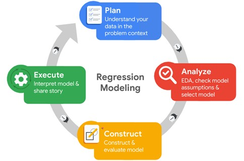
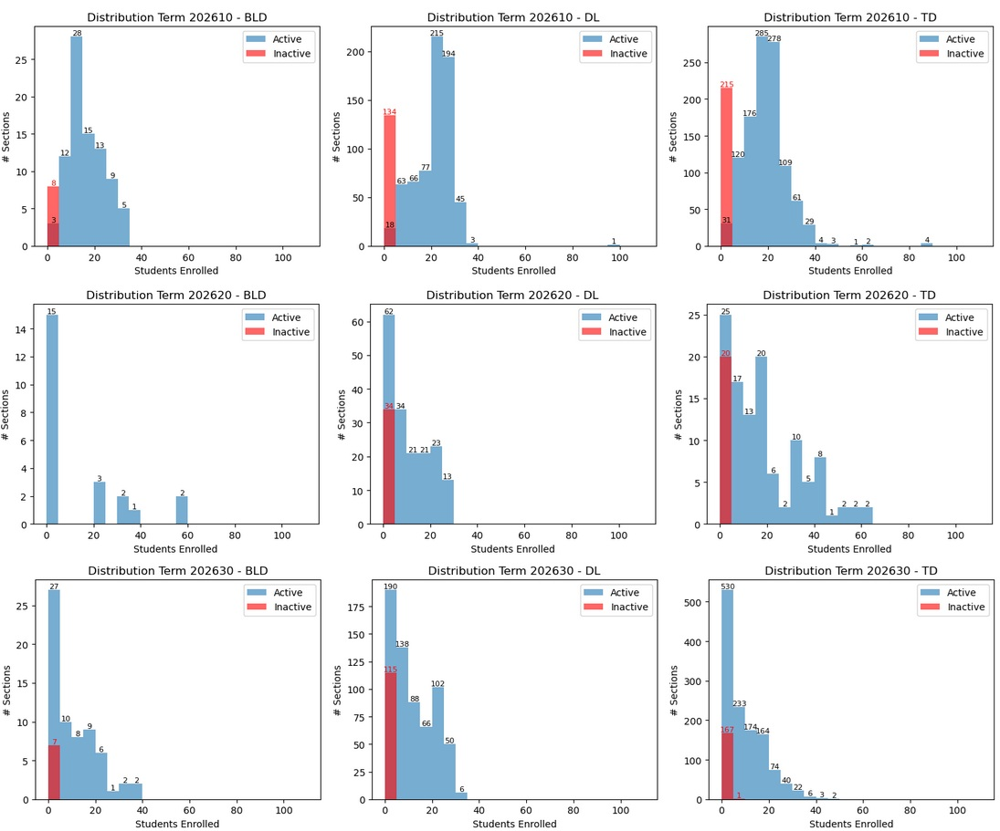
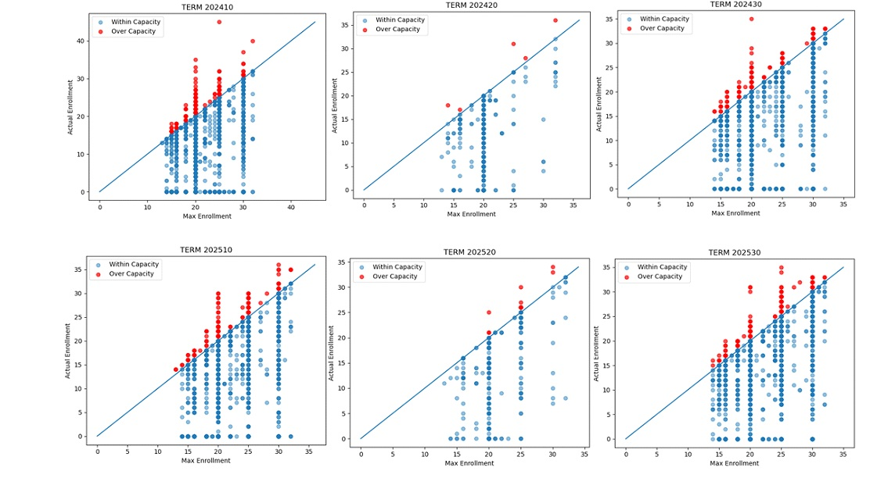
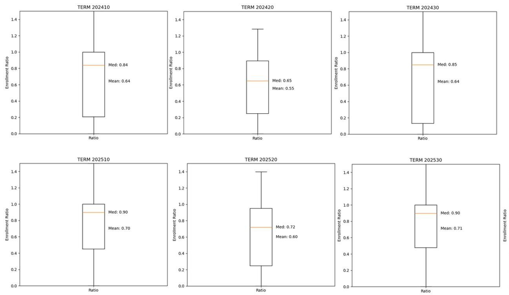

# Advanced Analytics Capstone  
# Course Demand Forecasting for Academic Scheduling

A machine learning project focused on forecasting **section-level course enrollment demand** using historical academic scheduling data from the Registrar’s Office at Mercy University.

The project applies predictive analytics, feature engineering, and seasonal machine learning models to support proactive academic planning, enrollment forecasting, and data-driven Registrar operations.

---

# Project Overview

Academic scheduling requires institutions to make operational decisions before final enrollment demand is known. Variability in student enrollment patterns can create challenges for:

- Section planning
- Course demand estimation
- Modality balancing
- Academic resource allocation
- Long-term scheduling strategy

This project develops a predictive enrollment forecasting workflow capable of estimating future section demand across:

- Spring
- Summer
- Fall

using historical Registrar scheduling data.

---

# Business Problem

Registrar offices often experience uncertainty around future course demand before student registration is finalized.

This can lead to:

- Overfilled sections
- Underutilized course offerings
- Last-minute scheduling adjustments
- Increased administrative workload
- Reactive planning decisions
- Difficulty identifying high-demand courses early

The objective of this project is to help academic scheduling teams anticipate section demand earlier through predictive analytics.

---

# Project Goals

The project focuses on:

- Forecasting section-level enrollment demand
- Identifying seasonal enrollment trends
- Understanding modality-based enrollment behavior
- Supporting proactive academic scheduling decisions
- Improving data-driven planning within Registrar operations
- Providing interpretable forecasting insights for stakeholders

---

# Project Objectives

The primary objectives include:

- Predict future section enrollment
- Analyze historical enrollment patterns
- Understand demand behavior across academic terms
- Evaluate modality-based demand trends
- Improve operational visibility before registration periods
- Support institutional planning through predictive analytics

---

# Deliverables

The project includes:

- Executive summary for stakeholders
- Technical report with methodology and findings
- Predictive model evaluation
- Enrollment trend visualizations
- Feature engineering documentation
- Ethical and governance considerations
- Forecasting workflow documentation

---

# PACE Framework

This project follows Google's PACE Framework:


| Stage | Description |
|---|---|
| **Plan** | Define business problem, stakeholders, objectives, and success metrics |
| **Analyze** | Perform exploratory data analysis and feature engineering |
| **Construct** | Build and validate machine learning forecasting models |
| **Execute** | Evaluate results, communicate insights, and identify operational impact |

---

# 🟨 PACE: Plan

## Initial Data Exploration

Initial analysis identified several important scheduling and enrollment behaviors:

- Enrollment demand varies significantly by:
  - term
  - modality
  - course
  - school
  - campus

- Historical enrollment patterns show recurring seasonal behavior across:
  - Spring
  - Summer
  - Fall

- In-person (`TD`) sections consistently demonstrate stronger enrollment demand during primary academic terms.

- Some sections repeatedly operate near or above enrollment capacity, indicating recurring demand pressure.

---

# Dataset Characteristics

The dataset contains academic scheduling and enrollment data including:

- Course identifiers
- Section information
- Campus locations
- Instructional modalities
- Meeting days and times
- Enrollment counts
- Maximum enrollment capacity
- Historical scheduling behavior
- Cross-listed course information

---

# Feature Engineering

Several engineered variables were created to improve forecasting accuracy and capture enrollment behavior patterns.

| Variable | Description |
|---|---|
| `COURSE_CODE` | Combined `SUBJECT + CRSNUMBER` identifier |
| `SECTION_SEQ` | Sequential section count |
| `INST_METHOD_GROUPED` | Grouped instructional modality |
| `TIME_BLOCK` | Morning / Afternoon / Evening |
| `NUM_MEETING_DAYS` | Number of weekly meeting days |
| `XLST_FLAG` | Cross-listed section indicator |
| `hist_avg_enroll` | Historical average enrollment |
| `hist_std_enroll` | Historical enrollment variability |
| `hist_max_enroll` | Historical peak enrollment |
| `hist_section_count` | Historical offering frequency |
| `last_hist_enroll` | Most recent historical enrollment |
| `last_same_term_enroll` | Most recent same-season enrollment |

These features allow the model to better understand:

- Historical demand patterns
- Seasonal enrollment behavior
- Modality trends
- Section frequency
- Cross-listed section dynamics

---

# Key Research Questions

This project addresses several operational and analytical questions:

- Can historical scheduling data accurately predict future enrollment?
- Which features are most useful for forecasting demand?
- How does enrollment behavior vary across academic terms?
- Do instructional modalities influence section demand?
- Can predictive analytics support earlier Registrar decision-making?

---

# Success Metrics

## Forecasting Metrics

| Metric | Purpose |
|---|---|
| `MAE` | Average prediction error |
| `RMSE` | Penalizes larger prediction errors |
| `R² Score` | Measures explained enrollment variance |

---

# 🟨 PACE: Analyze

The Analyze phase focused on exploratory data analysis, cleaning, standardization, and enrollment behavior analysis.

---

# Data Sources

The analysis used:

- Historical course scheduling data (Spring 2024 – Spring 2026)
- Fall 2026 validation data
- Registrar enrollment records

---

# Exploratory Data Analysis

## Key Observations

### Instructional Modality Demand

- In-person (`TD`) sections consistently show stronger enrollment demand.
- Spring and Fall terms have the highest enrollment activity.
- Summer enrollment patterns are lower and more concentrated.
  

---

## Course Cancellation Patterns

Canceled sections occur more frequently during:

- Spring
- Fall

This may reflect:
- enrollment balancing
- low-demand section consolidation
- operational scheduling adjustments

---

## Trimester & Quarter Term Exclusion

Trimester and Quarter terms were excluded because they:
- contain lower-volume specialized sections
- introduce statistical noise
- reduce model generalization

---

## Capacity Demand Analysis

Sections with maximum enrollment values of:

- `20`
- `25`
  


frequently operate near or above capacity during Spring and Fall terms.

This suggests recurring enrollment pressure and consistent demand concentration.

---

## Enrollment Ratio Trends

Enrollment ratio was calculated using:

```python
enrollment_ratio = SECTENROLL / MAXENROLL
```


### Seasonal Enrollment Behavior

| Term | Enrollment Trend |
|---|---|
| Spring | Higher |
| Summer | Lower |
| Fall | Higher |

---

## Demand by School & Modality

Analysis revealed:

- SLA courses dominate Spring and Fall demand.
- Nursing and HNS courses drive Summer demand.
- In-person sections generally outperform distance learning demand during primary academic terms.

---

# Data Challenges

| Challenge | Impact |
|---|---|
| Variability in `MTGTIME` and `MTGDAYS` | Required standardization |
| Cross-listed structures | Increased feature engineering complexity |
| Enrollment outliers | Required outlier analysis |
| Low-volume special terms | Reduced model stability |
| High granularity | Reduced generalization across small groups |

---

# 🟦 PACE: Construct

## Final Enrollment Forecasting Model

The final model forecasts section-level enrollment using historical Registrar scheduling data.

The forecasting workflow focuses entirely on:

- course demand forecasting
- enrollment prediction
- academic scheduling analytics

---

# Step 1 — Data Cleaning & Filtering

The dataset was standardized and filtered to include only:

- Active sections
- In-person (`TD`)
- Hybrid (`BLD`)

Distance learning modalities were consolidated into a single `DL` category.

```python
df['INST_METHOD_GROUPED'] = df['INST_METHOD'].replace({
    'WB': 'DL',
    'WH': 'DL',
    'WS': 'DL'
})
```

---

# Step 2 — Historical Enrollment Features

Historical enrollment behavior was aggregated using:

```python
course_history = (
    historical_df
    .groupby(['COURSE_CODE', 'INST_METHOD_GROUPED'])
)
```

The model captures:

- Average historical enrollment
- Enrollment variability
- Historical peak demand
- Historical section frequency
- Same-season enrollment behavior

---

# Step 3 — Seasonal Forecasting Strategy

Instead of using one global model, the final approach trains separate models for:

- Spring
- Summer
- Fall

This improves forecasting performance because enrollment behavior differs significantly by season.

---

# Step 4 — Final Machine Learning Model

The final forecasting model uses:

```python
XGBRegressor(
    n_estimators=300,
    max_depth=4,
    learning_rate=0.05,
    subsample=0.8,
    colsample_bytree=0.8,
    random_state=42
)
```

XGBoost was selected because it:
- handles structured tabular data effectively
- captures nonlinear enrollment behavior
- performs well with mixed feature types
- improves predictive stability across academic terms

---

# Final Model Features

| Feature Category | Examples |
|---|---|
| Historical Enrollment | Average enrollment, prior enrollment |
| Course Features | Course code, modality |
| Academic Term | Spring, Summer, Fall |
| Schedule Features | Meeting days, time block |
| Section Structure | Cross-listed indicators |

---

# Model Output

```python
predicted_enrollment_xgb
```

The final output predicts expected enrollment for each CRN in the target term.

---

# 🟥 PACE: Execute

## Seasonal Validation Results

The final seasonal XGBoost models achieved the following validation results:

| Season | Validation Term | MAE | RMSE | R² |
|---|---|---|---|---|
| Spring | 202610 | 3.079 | 4.320 | 0.739 |
| Summer | 202620 | 4.299 | 6.629 | 0.826 |
| Fall | 202530 | 2.948 | 4.376 | 0.757 |

---

# Model Interpretation

## Key Findings

- The model performed consistently across all academic terms.
- Fall achieved the lowest prediction error.
- Summer achieved the highest explained variance (`R² = 0.826`).
- Historical same-season enrollment behavior was one of the strongest predictive signals.
- Enrollment forecasting performance improved significantly after:
  - feature engineering
  - seasonal segmentation
  - outlier handling

---

# Business Impact

The forecasting workflow supports Registrar operations by:

- Improving visibility into future enrollment demand
- Identifying high-demand sections earlier
- Supporting proactive academic planning
- Reducing uncertainty before registration periods
- Helping departments anticipate enrollment pressure
- Supporting data-driven scheduling conversations

---

# Ethical Considerations

This project considers:

- Responsible institutional data usage
- Privacy and governance concerns
- Transparency in model interpretation
- Avoiding over-reliance on automated predictions
- Bias monitoring across schools and modalities

The model is intended to support decision-making rather than replace human academic planning processes.

---

# Tools & Technologies

## Programming Language

- Python

## Libraries

- Pandas
- NumPy
- Scikit-learn
- XGBoost
- Matplotlib
- Seaborn

## Development Environment

- Jupyter Notebook

---

# Future Improvements

Potential future enhancements include:

- Adding additional historical years
- Incorporating waitlist forecasting
- Adding department-level demand indicators
- Developing SHAP-based explainability dashboards
- Building interactive Tableau or Power BI dashboards
- Automating term-to-term forecasting workflows
- Monitoring long-term model drift

---

# Final Project Positioning

## Interview Summary

> “I developed a seasonal machine learning workflow to forecast section-level course enrollment using historical academic scheduling data, helping Registrar teams improve academic planning, identify demand patterns, and support data-driven scheduling decisions.”

---

# Strategic Outcome

This project demonstrates how predictive analytics can help Registrar departments transition from reactive scheduling support toward proactive academic planning.

By forecasting enrollment demand before final registration is known, the workflow provides earlier visibility into:

- section demand
- modality trends
- seasonal enrollment behavior
- operational planning needs

while strengthening data-driven decision-making across academic scheduling operations.
