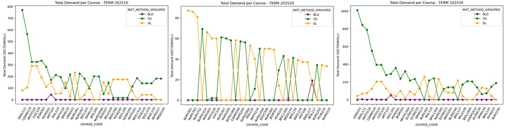

# Advanced Analytics Capstone  
# Course Demand Forecasting for Academic Scheduling

A machine learning project focused on forecasting **section-level course enrollment demand** using historical academic scheduling data from the Registrar’s Office at Mercy University.

The project applies predictive analytics, feature engineering, and seasonal machine learning models to support proactive academic planning, enrollment forecasting, and data-driven Scheduling operations.

---

# Project Overview

Academic scheduling requires institutions to make operational decisions before final enrollment demand is known. Variability in student enrollment patterns can create challenges for:

- Section planning
- Course demand estimation
- Modality balancing
- Academic resource allocation
- Long-term scheduling strategy

This project develops a predictive enrollment forecasting workflow capable of estimating future section demand across:

- Spring
- Summer
- Fall

using historical Registrar scheduling data.

---

# Business Problem

The Scheduling team often experience uncertainty around future course demand before student registration is finalized.

This can lead to:

- Overfilled sections
- Underutilized course offerings
- Last-minute scheduling adjustments
- Increased administrative workload
- Reactive planning decisions
- Difficulty identifying high-demand courses early

The objective of this project is to help academic scheduling teams anticipate section demand earlier through predictive analytics.

---

# Project Goals

The project focuses on:

- Forecasting section-level enrollment demand
- Identifying seasonal enrollment trends
- Understanding modality-based enrollment behavior
- Supporting proactive academic scheduling decisions
- Improving data-driven planning within Scheduling operations
- Providing interpretable forecasting insights for stakeholders

---

# Project Objectives

The primary objectives include:

- Predict future section enrollment
- Analyze historical enrollment patterns
- Understand demand behavior across academic terms
- Evaluate modality-based demand trends
- Improve operational visibility before registration periods
- Support institutional planning through predictive analytics

---

# Deliverables

The project includes:

- Executive summary for stakeholders
- Technical report with methodology and findings
- Predictive model evaluation
- Enrollment trend visualizations
- Feature engineering documentation
- Ethical and governance considerations
- Forecasting workflow documentation

---

# PACE Framework

This project follows Google's PACE Framework:


| Stage | Description |
|---|---|
| **Plan** | Define business problem, stakeholders, objectives, and success metrics |
| **Analyze** | Perform exploratory data analysis and feature engineering |
| **Construct** | Build and validate machine learning forecasting models |
| **Execute** | Evaluate results, communicate insights, and identify operational impact |

---

# 🟨 PACE: Plan

## Initial Data Exploration

Initial analysis identified several important scheduling and enrollment behaviors:

- Enrollment demand varies significantly by:
  - term
  - modality
  - course
  - school
  - campus

- Historical enrollment patterns show recurring seasonal behavior across:
  - Spring
  - Summer
  - Fall

- In-person (`TD`) sections consistently demonstrate stronger enrollment demand during primary academic terms.

- Some sections repeatedly operate near or above enrollment capacity, indicating recurring demand pressure.

---

# Dataset Characteristics

The dataset contains academic scheduling and enrollment data including:

- Course identifiers
- Section information
- Campus locations
- Instructional modalities
- Meeting days and times
- Enrollment counts
- Maximum enrollment capacity
- Historical scheduling behavior
- Cross-listed course information

---

# Feature Engineering

Several engineered variables were created to improve forecasting accuracy and capture enrollment behavior patterns.

| Variable | Description |
|---|---|
| `COURSE_CODE` | Combined `SUBJECT + CRSNUMBER` identifier |
| `SECTION_SEQ` | Sequential section count |
| `INST_METHOD_GROUPED` | Grouped instructional modality |
| `TIME_BLOCK` | Morning / Afternoon / Evening |
| `NUM_MEETING_DAYS` | Number of weekly meeting days |
| `XLST_FLAG` | Cross-listed section indicator |
| `hist_avg_enroll` | Historical average enrollment |
| `hist_std_enroll` | Historical enrollment variability |
| `hist_max_enroll` | Historical peak enrollment |
| `hist_section_count` | Historical offering frequency |
| `last_hist_enroll` | Most recent historical enrollment |
| `last_same_term_enroll` | Most recent same-season enrollment |

These features allow the model to better understand:

- Historical demand patterns
- Seasonal enrollment behavior
- Modality trends
- Section frequency
- Cross-listed section dynamics

---

# Key Research Questions

This project addresses several operational and analytical questions:

- Can historical scheduling data accurately predict future enrollment?
- Which features are most useful for forecasting demand?
- How does enrollment behavior vary across academic terms?
- Do instructional modalities influence section demand?
- Can predictive analytics support earlier Scheduling decision-making?

---

# Success Metrics

## Forecasting Metrics

| Metric | Purpose |
|---|---|
| `MAE` | Average prediction error |
| `RMSE` | Penalizes larger prediction errors |
| `R² Score` | Measures explained enrollment variance |

---

# 🟨 PACE: Analyze

The Analyze phase focused on exploratory data analysis, cleaning, standardization, and enrollment behavior analysis.

---

# Data Sources

The analysis used:

- Historical course scheduling data (Spring 2024 – Spring 2026)
- Fall 2026 validation data
- Scheduling enrollment records

---

# Exploratory Data Analysis

## Key Observations

### Instructional Modality Demand

- In-person (`TD`) sections consistently show stronger enrollment demand.
- Spring and Fall terms have the highest enrollment activity.
- Summer enrollment patterns are lower and more concentrated.
  

---

## Course Cancellation Patterns

Canceled sections occur more frequently during:

- Spring
- Fall

This may reflect:
- enrollment balancing
- low-demand section consolidation
- operational scheduling adjustments

---

## Trimester & Quarter Term Exclusion

Trimester and Quarter terms were excluded because they:
- contain lower-volume specialized sections
- introduce statistical noise
- reduce model generalization

---

## Capacity Demand Analysis

Sections with maximum enrollment values of:

- `20`
- `25`
  


frequently operate near or above capacity during Spring and Fall terms.

This suggests recurring enrollment pressure and consistent demand concentration.

---

## Enrollment Ratio Trends

Enrollment ratio was calculated using:

```python
enrollment_ratio = SECTENROLL / MAXENROLL
```

### Seasonal Enrollment Behavior

| Term | Enrollment Trend |
|---|---|
| Spring | Higher |
| Summer | Lower |
| Fall | Higher |


---

## Demand by School & Modality

Analysis revealed:

- SLA courses dominate Spring and Fall demand.
- Nursing and HNS courses drive Summer demand.
- In-person sections generally outperform distance learning demand during primary academic terms.


---

# Data Challenges

| Challenge | Impact |
|---|---|
| Variability in `MTGTIME` and `MTGDAYS` | Required standardization |
| Cross-listed structures | Increased feature engineering complexity |
| Enrollment outliers | Required outlier analysis |
| Low-volume special terms | Reduced model stability |
| High granularity | Reduced generalization across small groups |

---
# Variable Selection and Correlation Analysis

To make the forecasting model more transparent, we reviewed which variables were included in each seasonal model and evaluated how strongly numerical variables relate to actual enrollment.

---

## Step 1 — Review Variables Used by Each Seasonal Model

```python
for season, (model, train_cols) in models.items():
    print(f"\n{season} MODEL VARIABLES ({len(train_cols)})")
    print(sorted(train_cols))
```

This code prints the variables used by each model, separated by season.

Because Spring, Summer, and Fall have different enrollment behaviors, each seasonal model may use a slightly different set of variables.

### Why this matters

For non-technical users, this step helps answer:

> “What information is the model using to make predictions?”

For data users, this confirms:

- which features were passed into training
- whether each seasonal model uses the expected variables
- whether irrelevant or redundant variables were removed

---

# Step 2 — Identify Numerical Variables

```python
num_vars = train_df.select_dtypes(include=['number']).columns
```

This code selects only numerical columns from the training dataset.

Examples of numerical variables may include:

- `SECTENROLL`
- `MAXENROLL`
- `hist_avg_enroll`
- `hist_std_enroll`
- `hist_max_enroll`
- `last_hist_enroll`
- `last_same_term_enroll`

### Why only numerical variables?

Correlation analysis works best with numerical data because it measures how strongly two numeric values move together.

Categorical fields such as course, campus, modality, or meeting days are important, but they need to be encoded before they can be used in most machine learning models.

---

# Step 3 — Build a Correlation Matrix

```python
corr_matrix = train_df[num_vars].corr()
```

The correlation matrix compares every numerical variable against every other numerical variable.

Correlation values range from:

| Value | Meaning |
|---|---|
| `+1.00` | Strong positive relationship |
| `0.00` | No clear linear relationship |
| `-1.00` | Strong negative relationship |

---

# Step 4 — Visualize the Correlation Heatmap

```python
plt.figure(figsize=(14,10))

sns.heatmap(
    corr_matrix,
    annot=True,
    fmt='.2f',
    cmap='coolwarm',
    center=0
)

plt.title('Correlation Heatmap - Numerical Features')
plt.tight_layout()
plt.show()
```

The heatmap helps visually identify relationships between numerical variables.

### How to read it

- Strong positive values mean two variables increase together.
- Strong negative values mean one variable increases while the other decreases.
- Values close to zero suggest little or no linear relationship.

---

## Example Interpretation

If `MAXENROLL` has a strong positive correlation with `SECTENROLL`, it means courses with larger enrollment caps usually tend to enroll more students.

If `AVAILSEATS` is highly related to `SECTENROLL`, it may create redundancy because available seats are directly connected to enrollment and capacity.

---

# Step 5 — Measure Correlation with Enrollment

```python
corr_target = (
    train_df
    .select_dtypes(include=['number'])
    .corr()['SECTENROLL']
    .sort_values()
)
```

This code focuses only on the relationship between each numerical variable and the target variable:

```python
SECTENROLL
```

`SECTENROLL` represents actual student enrollment and is the value the model is trying to predict.

---

# Step 6 — Plot Correlation with Enrollment

```python
plt.figure(figsize=(8,6))

corr_target.drop('SECTENROLL').plot(kind='barh')

plt.title('Correlation with Enrollment (SECTENROLL)')
plt.xlabel('Correlation')
plt.tight_layout()
plt.show()
```

This chart ranks numerical variables based on how strongly they relate to enrollment.

### Purpose

This helps identify which variables may be useful predictors and which variables may add little value.

---

# Variable Selection Methodology

Variables were selected using a combination of:

1. **Domain knowledge**
2. **Correlation analysis**
3. **Redundancy checks**
4. **Model interpretability**
5. **Operational relevance**

---

## 1. Domain Knowledge

Variables were first reviewed based on whether they make sense in a real scheduling environment.

For example:

| Variable | Why it matters |
|---|---|
| `COURSE_CODE` | Different courses have different demand levels |
| `CAMPUS` | Demand may vary by campus |
| `INST_METHOD_GROUPED` | In-person, hybrid, and online courses behave differently |
| `MTGDAYS` | Meeting patterns affect enrollment behavior |
| `TIME_BLOCK` | Morning, afternoon, and evening sections may attract different demand |
| `MAXENROLL` | Course capacity often reflects expected demand |

This ensured the model used variables that are meaningful to Scheduling operations.

---

## 2. Correlation Analysis

Correlation analysis was used to understand how numerical variables relate to enrollment.

Variables with stronger relationships to `SECTENROLL` were considered more useful for prediction.

For example:

```python
corr_target = train_df.select_dtypes(include=['number']).corr()['SECTENROLL']
```

This helped identify variables such as:

- `MAXENROLL`
- `hist_avg_enroll`
- `hist_max_enroll`
- `last_hist_enroll`
- `last_same_term_enroll`

as important predictors of enrollment demand.

---

## 3. Redundancy Checks

Some variables were removed when they repeated the same information or were too directly connected to the target variable.

### Example

`AVAILSEATS` was removed because it is mathematically related to enrollment:

```python
AVAILSEATS = MAXENROLL - SECTENROLL
```

Including this variable could cause data leakage because it gives the model indirect information about the value it is trying to predict.

### Why this is important

For non-technical users:

> The model should predict enrollment using information available before enrollment is finalized, not information that already depends on enrollment.

For data users:

> Removing leakage variables improves model validity and prevents artificially inflated performance.

---

## 4. Model Interpretability

Variables were also selected based on whether their meaning could be explained clearly.

The goal was not only to build a model that performs well, but also one that stakeholders can understand and trust.

For example, variables like:

- historical average enrollment
- last same-term enrollment
- course modality
- campus
- maximum enrollment

are easier to explain than unclear or overly granular fields.

---

## 5. Operational Relevance

The selected variables needed to support real scheduling decisions.

Variables were prioritized when they could help answer questions such as:

- Which courses are likely to have high demand?
- Which sections may need larger rooms?
- Which campuses have stronger in-person demand?
- Which meeting patterns usually enroll more students?
- Which historical trends should guide future scheduling?

---

# Final Variable Selection Logic

The final model variables were selected when they met most of the following criteria:

| Criteria | Description |
|---|---|
| Predictive Value | Related to enrollment demand |
| Operational Meaning | Useful for scheduling decisions |
| Low Redundancy | Does not duplicate another variable |
| No Leakage | Does not reveal the target value |
| Seasonal Relevance | Useful for Spring, Summer, or Fall patterns |
| Interpretability | Easy to explain to stakeholders |

---

# Summary for Non-Technical Stakeholders

The model variables were selected by reviewing which course and scheduling characteristics are most connected to student enrollment.

We used historical enrollment, course details, modality, campus, schedule timing, and prior-term performance to predict future demand.

Variables that were too closely tied to final enrollment, such as available seats, were removed to avoid giving the model information it would not realistically have before registration is complete.

---

# Summary for Technical Users

The feature selection process combined correlation analysis, target relationship review, leakage prevention, and domain-informed filtering.

Numerical predictors were evaluated using a correlation matrix and target correlation plot. Highly redundant or leakage-prone variables, such as `AVAILSEATS`, were excluded. Final training columns were reviewed by season using the `models.items()` loop to confirm the exact feature set used in each seasonal model.

---

# Conclusion

This methodology helped create a more reliable, explainable, and operationally useful forecasting model.

The selected variables allow the model to estimate enrollment demand using realistic pre-registration information, while avoiding redundant or misleading inputs that could reduce model quality.

# 🟦 PACE: Construct

## Final Enrollment Forecasting Model

The final model forecasts section-level enrollment using historical scheduling data.

The forecasting workflow focuses entirely on:

- course demand forecasting
- enrollment prediction
- academic scheduling analytics

---

# Step 1 — Data Cleaning & Filtering

The dataset was standardized and filtered to include only:

- Active sections
- In-person (`TD`)
- Hybrid (`BLD`)

Distance learning modalities were consolidated into a single `DL` category.

```python
df['INST_METHOD_GROUPED'] = df['INST_METHOD'].replace({
    'WB': 'DL',
    'WH': 'DL',
    'WS': 'DL'
})
```

---

# Step 2 — Historical Enrollment Features

Historical enrollment behavior was aggregated using:

```python
course_history = (
    historical_df
    .groupby(['COURSE_CODE', 'INST_METHOD_GROUPED'])
)
```

The model captures:

- Average historical enrollment
- Enrollment variability
- Historical peak demand
- Historical section frequency
- Same-season enrollment behavior

---

# Step 3 — Seasonal Forecasting Strategy

Instead of using one global model, the final approach trains separate models for:

- Spring
- Summer
- Fall

This improves forecasting performance because enrollment behavior differs significantly by season.

---

# Step 4 — Final Machine Learning Model

The final forecasting model uses:

```python
XGBRegressor(
    n_estimators=300,
    max_depth=4,
    learning_rate=0.05,
    subsample=0.8,
    colsample_bytree=0.8,
    random_state=42
)
```

XGBoost was selected because it:
- handles structured tabular data effectively
- captures nonlinear enrollment behavior
- performs well with mixed feature types
- improves predictive stability across academic terms

---

# Final Model Features

| Feature Category | Examples |
|---|---|
| Historical Enrollment | Average enrollment, prior enrollment |
| Course Features | Course code, modality |
| Academic Term | Spring, Summer, Fall |
| Schedule Features | Meeting days, time block |
| Section Structure | Cross-listed indicators |

---

# Model Output

```python
predicted_enrollment_xgb
```

The final output predicts expected enrollment for each CRN in the target term.

---

# 🟥 PACE: Execute

## Seasonal Validation Results

The final seasonal XGBoost models achieved the following validation results:

| Season | Validation Term | MAE | RMSE | R² |
|---|---|---|---|---|
| Spring | 202610 | 3.079 | 4.320 | 0.739 |
| Summer | 202620 | 4.299 | 6.629 | 0.826 |
| Fall | 202530 | 2.948 | 4.376 | 0.757 |

---

# Understanding the Evaluation Metrics

The model was evaluated using three primary regression metrics:

| Metric | Meaning |
|---|---|
| `MAE` | Average enrollment prediction error |
| `RMSE` | Measures larger prediction errors more heavily |
| `R²` | Measures how much enrollment variation is explained by the model |

---

# MAE — Mean Absolute Error

## Definition

MAE measures the average difference between:

- predicted enrollment
- actual enrollment

The lower the MAE, the more accurate the model predictions are on average.

---

## Example

If a section actually enrolled:

```python
30 students
```

and the model predicted:

```python
27 students
```

the prediction error is:

```python
3 students
```

---

## Interpretation of Results

| Season | MAE Interpretation |
|---|---|
| Spring | Predictions are off by approximately 3 students on average |
| Summer | Predictions are off by approximately 4.3 students on average |
| Fall | Predictions are off by approximately 2.9 students on average |

---

## Key Insight

The Fall model achieved the lowest average prediction error, meaning it generated the most precise enrollment forecasts overall.

This suggests Fall enrollment behavior is:
- more stable
- more historically consistent
- easier for the model to learn

---

# RMSE — Root Mean Squared Error

## Definition

RMSE measures prediction error similarly to MAE but gives larger penalties to bigger mistakes.

This helps identify whether the model occasionally produces large forecasting errors.

---

## Example

Suppose two sections have prediction errors:

| Section | Error |
|---|---|
| Section A | 2 students |
| Section B | 12 students |

RMSE penalizes the 12-student error more heavily than MAE.

---

## Interpretation of Results

| Season | RMSE Interpretation |
|---|---|
| Spring | Some larger forecasting errors exist but remain controlled |
| Summer | Greater enrollment variability creates larger prediction swings |
| Fall | Forecasting remains relatively stable |

---

## Key Insight

Summer produced the highest RMSE because summer enrollment behavior is:
- less consistent
- more volatile
- lower volume
- heavily dependent on specific programs and modalities

Even though Summer achieved the strongest R² score, its enrollment variability increases large-error sensitivity.

---

# R² — Coefficient of Determination

## Definition

R² measures how much of the enrollment variation can be explained by the model.

Values closer to:

```python
1.0
```

indicate stronger predictive performance.

---

## Interpretation of Results

| Season | R² Interpretation |
|---|---|
| Spring | Model explains ~74% of enrollment variation |
| Summer | Model explains ~83% of enrollment variation |
| Fall | Model explains ~76% of enrollment variation |

---

## Key Insight

The Summer model achieved the highest R² value:

```python
0.826
```

meaning the model successfully captured most of the enrollment behavior during Summer terms.

This may occur because:
- Summer offerings are smaller
- fewer modalities are offered
- scheduling patterns are more concentrated
- fewer sections create more identifiable enrollment behavior

---

# Overall Model Interpretation

The seasonal forecasting strategy demonstrated strong predictive performance across all academic terms.

## Main Findings

- Historical enrollment behavior is highly predictive of future enrollment.
- Same-season historical enrollment is one of the strongest forecasting signals.
- Enrollment behavior differs significantly between:
  - Spring
  - Summer
  - Fall

which validates the decision to train separate seasonal models.

---

# Operational Interpretation for the Scheduling Team

From a Scheduling perspective, forecasting within approximately:

```python
±3 students
```

for most Spring and Fall sections provides meaningful planning value before registration begins.

Examples of operational value include:

- identifying sections likely to exceed capacity
- monitoring low-demand offerings earlier
- anticipating enrollment pressure by modality
- supporting discussions with academic departments
- improving section planning visibility before schedules finalize

---

# Business Impact

The forecasting workflow supports Scheduling operations by:

- Improving visibility into future enrollment demand
- Identifying high-demand sections earlier
- Supporting proactive academic planning
- Reducing uncertainty before registration periods
- Helping departments anticipate enrollment pressure
- Supporting data-driven scheduling conversations

---

# Ethical Considerations

This project considers:

- Responsible institutional data usage
- Privacy and governance concerns
- Transparency in model interpretation
- Avoiding over-reliance on automated predictions
- Bias monitoring across schools and modalities

The model is intended to support decision-making rather than replace human academic planning processes.

---

# Tools & Technologies

## Programming Language

- Python

## Libraries

- Pandas
- NumPy
- Scikit-learn
- XGBoost
- Matplotlib
- Seaborn

## Development Environment

- Jupyter Notebook

---

# Future Improvements

Potential future enhancements include:

- Adding additional historical years
- Incorporating waitlist forecasting
- Adding department-level demand indicators
- Developing SHAP-based explainability dashboards
- Building interactive Tableau or Power BI dashboards
- Automating term-to-term forecasting workflows
- Monitoring long-term model drift

---

# Strategic Outcome

This project demonstrates how predictive analytics can help transition from reactive scheduling support toward proactive academic planning.

By forecasting enrollment demand before final registration is known, the workflow provides earlier visibility into:

- section demand
- modality trends
- seasonal enrollment behavior
- operational planning needs

---

# Scheduling Operational Outcome

One of the proposed operational outcomes of this project is the integration of forecasted enrollment values directly into future academic section rolls.

The forecasted enrollment amount can be added as a reference value during the rolling process for future terms, allowing scheduling teams and academic departments to review predicted demand before schedules are finalized.

This creates several operational advantages:

- Improved visibility into expected section demand
- Earlier identification of high-demand courses
- Better planning for section offerings
- Stronger support for proactive scheduling decisions
- Enhanced communication between the Scheduling team and academic departments

---

# Example Use Case

When rolling a future section into an upcoming term:

| CRN | Course | Historical Avg | Forecasted Enrollment |
|---|---|---|---|
| 24510 | BIOL130 | 24 | 31 |
| 24522 | ENGL110 | 18 | 17 |
| 24531 | NURS320 | 20 | 34 |

Scheduling teams could immediately identify:

- sections likely to experience enrollment pressure
- sections potentially requiring additional offerings
- courses showing declining demand trends

before registration officially begins.

---

# Long-Term Institutional Value

Over time, this forecasting workflow can help institutions:

- strengthen academic planning
- improve forecasting visibility
- reduce reactive scheduling adjustments
- support evidence-based decision-making
- improve operational efficiency across Scheduling workflows

while maintaining human oversight and institutional scheduling expertise.
